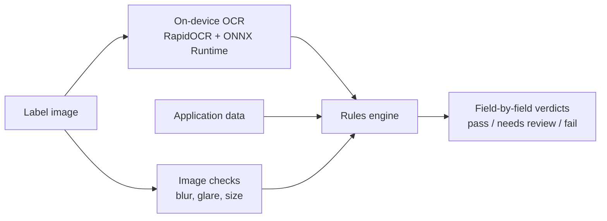

# Label Verification (prototype)

A web tool that checks alcohol beverage label artwork against the data in a COLA application: brand name, class/type, alcohol content, net contents, bottler, country of origin, and the Government Health Warning Statement. It handles one label at a time or a batch of hundreds, and gives each field a plain-English verdict.

It runs entirely on your own computer. Labels are read by on-device OCR, so nothing is sent over the internet, and there are no accounts, API keys or cloud services.

- **Check one label:** drop in an image, type the application details, press **Check label**. There are 11 built-in examples if you don't have a label handy.
- **Check many labels:** drop in all the images plus a CSV of application data. Results stream in, problems sort to the top, and you can download a results CSV.

The take-home brief this responds to is in [BRIEF.md](BRIEF.md).

---

## Run it on your computer

Works on Windows, macOS and Linux.

**1. Install Python 3.10 or newer** (one time) from [python.org/downloads](https://www.python.org/downloads/). Version 3.12 or 3.13 is the safest choice. On Windows, tick **"Add python.exe to PATH"** in the installer.

**2. Get the app.** On [the GitHub page](https://github.com/simlavelle/instructions), click **Code → Download ZIP** and unzip it, or run `git clone https://github.com/simlavelle/instructions.git`.

**3. Start it** from the app folder:

| Windows | macOS | Linux (or macOS Terminal) |
|---|---|---|
| Double-click **`start.bat`** | Double-click **`start.command`** | Run `./start.sh` |

The first start sets up a private Python environment in a `.venv` folder inside the app folder and installs what the app needs. This takes a few minutes and needs internet access. After that, the app starts in a few seconds and works offline.

Your browser opens the app at http://127.0.0.1:8000. Keep the window that opened (a Command Prompt or Terminal) open while you use it. To stop the app, press Ctrl+C or close that window.

Options go after the command, for example `./start.sh --port 8080` or `start.bat --no-browser`:

| Option | |
|---|---|
| `--port 8080` | Use a different port. If the port is taken, the next free one is used automatically. |
| `--no-browser` | Don't open a browser window. |
| `--host 0.0.0.0` | Let other computers on your network use it. The start message shows the address to give them. |

**Prefer Docker?** Run `docker compose up --build` and open http://localhost:8000.

### If something goes wrong

| Problem | What to do |
|---|---|
| "Python 3.10 or newer is needed" | Install Python from python.org. On Windows, tick "Add python.exe to PATH". Then open a new window and try again. |
| macOS says `start.command` can't be opened | Right-click it, choose **Open**, then **Open** again. You only have to do this once. Or run `./start.sh` in Terminal. |
| Linux: "Couldn't create a Python environment" | Install the venv module: `sudo apt install python3-venv` |
| Installing packages fails | Check the internet connection or proxy. On an Intel Mac, use Python 3.13: the OCR runtime has no Intel-Mac build for 3.14. |
| You want a clean start | Delete the `.venv` folder in the app folder and start again. |

---

## How it works



- **OCR reads; plain rules decide; the agent has the final say.** OCR turns the image into lines of text. Every match or mismatch is decided by small, tested rules in [`app/verification/`](app/verification/) that explain themselves ("the label says 40% but the application says 45%"). The tool advises the agent and never approves or rejects on its own.
- **Nothing leaves the computer.** The OCR models ship inside the `rapidocr` Python package. The web page loads nothing from the internet (no CDNs, no web fonts). Images are checked in memory and never saved. This also means the tool keeps working on a network that blocks outside services.
- **Hard photos are retried before giving up.** When an image is dim, glary or blurry, the OCR runs again after correcting the lighting and filling in glare. When almost nothing is read, it tries the image rotated. Text hidden by glare goes to **needs review** instead of failing the label.
- **Bold type is measured.** Whether "GOVERNMENT WARNING:" is bold is estimated by comparing letter stroke thickness with the text that follows it.

On a laptop, a label takes 0.3–0.6 s from upload to result.

---

## What we heard, and what we built

| From the interviews | In the prototype |
|---|---|
| "If we can't get results back in about 5 seconds, nobody's going to use it." (Sarah) | 0.3–0.6 s per label end to end, with no network round trips. |
| "Something my mother could figure out." Half the team is over 50. | One screen per task, numbered steps, 18 px base text, 48–60 px buttons, verdicts shown with icon, word and color (never color alone), plain-English messages, a **Print these results** button, and one-click examples. |
| Batch uploads for importers who send 200–300 labels at once. (Sarah, Janet) | **Check many labels** tab: images plus a CSV, live progress with time remaining, a Stop button, problems sorted first, filter tiles, and a results CSV download. About 3 labels a second. |
| Firewall blocks outbound ML endpoints; the last vendor's pilot broke on it. (Marcus) | No outbound connections at all once installed. The OCR runs on the machine serving the app. |
| No storage of sensitive data for the prototype. (Marcus) | Stateless: images are processed in memory and discarded. No database and no disk writes. |
| "STONE'S THROW" vs "Stone's Throw": obviously the same, you need judgment. (Dave) | Differences in capitalization, punctuation, spacing, accents or state abbreviations count as a match, with a note saying what differs. Near-misses go to **needs review** with the differing words shown. Only real differences fail. |
| The warning must be word for word, with "GOVERNMENT WARNING:" in all caps and bold. Title case gets rejected. (Jenny) | Three separate warning checks (capitals, exact wording, bold) and a word-level diff that strikes out missing words and underlines replacements. |
| Photos at odd angles, bad lighting, glare. (Jenny) | Glare and blur detection, lighting correction and rotation retries, and a more forgiving review threshold for poor images. |

---

## Verification rules

Blank application fields are skipped, not failed. Only the brand name is required.

| Field | Match | Needs review | Fail |
|---|---|---|---|
| Brand name, class/type, bottler, country | Same text, ignoring capitalization, punctuation, spacing and accents; state names and abbreviations are treated as equal; extra words such as "Bottled by" are ignored. The brand is looked for in large type first, so the brand inside the bottler's small-print name doesn't hide a difference. | At least 85% similar (75% when the image has glare, blur or low resolution), with the differing words shown | Anything less, or not found |
| Alcohol content | Same % ABV; proof must equal 2 × ABV if printed | Application value has no readable number | Different ABV or proof, or no statement on the label |
| Net contents | Same volume, including equivalent units (12 FL. OZ. = 355 mL, 75 cl = 750 mL) | Application value has no readable volume | Different volume, or none on the label |
| Government warning: capitals | "GOVERNMENT WARNING" in capitals, followed by a colon | Colon not found (OCR can miss it) | Not in capitals, or header missing |
| Government warning: wording | Word for word with 27 CFR 16.21 (the body may be in any case) | A letter or two off in at most a couple of words (likely an OCR misread) | Any word missing, added or changed |
| Government warning: bold | Header visibly heavier than the body | Not bold, or couldn't tell (the agent confirms by eye) | — |
| Government warning: presence | — | — | No warning on the label |

Overall verdict: any fail → **Problems found**; otherwise any review → **Needs review**; otherwise **Looks good**.

---

## Test labels and results

[`scripts/generate_samples.py`](scripts/generate_samples.py) renders 11 synthetic labels into [`app/static/samples/`](app/static/samples/), each built to exercise one situation from the interviews. They double as the in-app examples and as the regression suite in [`tests/test_samples.py`](tests/test_samples.py).

| Sample | Intended outcome | Result |
|---|---|---|
| Bourbon, everything matches (the brief's example; application says KY, label says Kentucky) | Looks good | Looks good |
| Gin, STONE'S THROW vs Stone's Throw | Looks good | Looks good |
| Vodka, label 40% (80 proof) vs application 45% (90 proof) | Problems found | Problems found |
| Rum, "Government Warning:" in title case | Problems found | Problems found |
| IPA, warning missing two phrases; 12 FL. OZ. vs 355 mL | Problems found (volume matches) | Problems found |
| Rye, warning header not bold | Needs review | Needs review |
| Imported wine, "Product of France" | Looks good | Looks good |
| Wheat ale, GOLDEN FIELD vs Golden Fields | Needs review | Needs review |
| Tequila, no warning at all | Problems found | Problems found |
| Bourbon photo: tilted, curved shading, glare over the name | Looks good or Needs review | Needs review (glare hides letters) |
| Gin photo: dim and noisy | Looks good or Needs review | Looks good |

In a stress run with every sample rescaled to random sizes (0.6×–2.2×), 43 of 44 got the intended verdict. Latency was 0.28 s on average and 0.5 s at most (Intel Mac laptop, 4 OCR threads).

---

## API

`POST /api/verify` (multipart form)

| Field | |
|---|---|
| `image` | Label image (JPG, PNG, WebP, up to 20 MB) |
| `application` | JSON: `brand_name` (required), `class_type`, `alcohol_content`, `net_contents`, `bottler`, `country_of_origin` |

```bash
curl -F image=@app/static/samples/river-bend-vodka.png \
     -F 'application={"brand_name":"River Bend","alcohol_content":"45%"}' \
     http://127.0.0.1:8000/api/verify
```

It returns the verdict, a headline, per-field checks (status, application value, label value, message, warning diff), timing, image-quality notes, and the full OCR text. Errors return `{"detail": "<message an agent can read>"}` with 400 (bad image), 413 (too large) or 422 (bad application data). `GET /api/health` returns `{"status": "ok"}`.

### Batch CSV format

One row per label. `filename` must match the image file name (case-insensitive). The header row accepts common variants such as `brand` or `abv`. A template is at `/static/samples/batch-template.csv`.

```csv
filename,brand_name,class_type,alcohol_content,net_contents,bottler,country_of_origin
old-tom-bourbon.png,OLD TOM DISTILLERY,Kentucky Straight Bourbon Whiskey,45% Alc./Vol. (90 Proof),750 mL,"Old Tom Distillery, Louisville, KY",
```

The browser sends labels to `/api/verify` four at a time, so the server keeps no state. Closing the browser tab stops the batch.

---

## Sharing it with a team

- **From one computer:** start it with `--host 0.0.0.0`, and others on the same network can open the address it prints. There is no sign-in, so only do this on a trusted network.
- **On a server:** build the [`Dockerfile`](Dockerfile), or use `docker compose up -d --build`. Give it about 2 GB of RAM (OCR peaks around 1.5 GB). [`render.yaml`](render.yaml) sets it up on Render; it runs the same way on Azure Container Apps or any container host, listening on `$PORT` (default 8000) with a health check at `/api/health`.

Set `OCR_THREADS` (default 4) to change how many CPU threads the OCR uses.

---

## Development

```bash
python3 -m venv .venv
source .venv/bin/activate          # Windows: .venv\Scripts\activate
pip install -r requirements-dev.txt
pytest                             # 80 tests, about 6 seconds, no network needed
uvicorn app.main:app --reload      # run with auto-reload
python scripts/generate_samples.py # re-render the sample labels
```

### Project layout

```
run.py                    Launcher: sets up .venv on first run, starts the server, opens the browser
start.bat / start.command / start.sh   Double-click or terminal wrappers that find Python and call run.py
app/
  main.py                 FastAPI app: /api/verify, /api/health, static UI, security headers
  models.py               Pydantic models shared by the OCR, rules and API
  imaging.py              Image loading, quality checks, lighting/glare correction
  ocr.py                  On-device OCR: retries, fixed input size, bold estimate
  verification/
    normalize.py          Text normalization levels
    fields.py             Brand/class/bottler/country, alcohol, net contents rules
    warning.py            Government warning checks and word diff
    engine.py             Runs every check and produces the verdict
  static/                 UI (plain HTML/CSS/JS modules, no build step) and sample labels
scripts/generate_samples.py   Renders the synthetic test labels
tests/                    Unit, API, launcher and end-to-end sample tests
```

---

## Assumptions and limitations

- **Standalone prototype.** No COLA integration and no sign-in. Application data is typed in or uploaded as CSV.
- **Scope of rules.** Covers the fields in the brief. It does not check type-size minimums (these need the physical container size), standards of fill, beverage-specific rules (for example, when wine or beer may omit alcohol content), or statements like sulfites and colour additives.
- **OCR limits.** Heavily stylized fonts, text curved around a bottle, and very small print can be misread. When that happens the tool says what it couldn't read and asks for review instead of failing the label. Bold detection is an estimate, so a non-bold header goes to review, not fail.
- **Sample labels are synthetic.** Before relying on accuracy figures, evaluate on a few hundred real, anonymized COLA images and tune the review thresholds against agent decisions.
- **Batch runs in the browser.** That keeps the server stateless, but closing the tab ends the batch. A production version would use a server-side job queue with retention rules.

## Next steps

1. Evaluate on real COLA images and tune the review thresholds from agent feedback.
2. Add beverage-type rules (wine, malt, spirits) and the remaining mandatory statements.
3. Move batch processing to a server-side queue, then integrate with COLA.
4. Let agents mark a flagged item "accepted", and feed those decisions back into threshold tuning.
